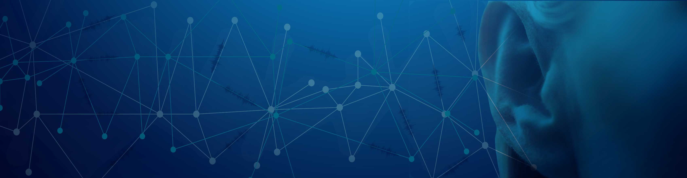

# Arabic Natural Audio Dataset

Emotion expression is an essential part of human interaction. The same text can hold different meanings when expressed with different emotions. Thus understanding the text alone is not enough for getting the meaning of an utterance. Acted and natural corpora have been used to detect emotions from speech. Many speech databases for different languages including English, German, Chinese, Japanese, Russian, Italian, Swedish and Spanish exist for modeling emotion recognition. Since there is no reported reference of an available Arabic corpus, we decided to collect the first Arabic Natural Audio Dataset (ANAD) to recognize discrete emotions.

Embedding an effective emotion detection feature in speech recognition system seems a promising solution for decreasing the obstacles faced by the deaf when communicating with the outside world. There exist several applications that allow the deaf to make and receive phone calls normally, as the hearing-impaired individual can type a message and the person on the other side hears the words spoken, and as they speak, the words are received as text by the deaf individual. However, missing the emotion part still makes these systems not hundred percent reliable. Having an effective speech to text and text to speech system installed in their everyday life starting from a very young age will hopefully replace the human ear. Such systems will aid deaf people to enroll in normal schools at very young age and will help them to adapt better in classrooms and with their classmates. It will help them experience a normal childhood and hence grow up to be able to integrate within the society without external help.

Eight videos of live calls between an anchor and a human outside the studio were downloaded from online Arabic talk shows. Each video was then divided into turns: callers and receivers. To label each video, 18 listeners were asked to listen to each video and select whether they perceive a happy, angry or surprised emotion. Silence, laughs and noisy chunks were removed. Every chunk was then automatically divided into 1 sec speech units forming our final corpus composed of 1384 records.

Twenty five acoustic features, also known as low-level descriptors, were extracted. These features are: intensity, zero crossing rates, MFCC 1-12 (Mel-frequency cepstral coefficients), F0 (Fundamental frequency) and F0 envelope, probability of voicing and, LSP frequency 0-7. On every feature nineteen statistical functions were applied. The functions are: maximum, minimum, range, absolute position of maximum, absolute position of minimum, arithmetic of mean, Linear Regression1, Linear Regression2, Linear RegressionA, Linear RegressionQ, standard Deviation, kurtosis, skewness, quartiles 1, 2, 3 and, inter-quartile ranges 1-2, 2-3, 1-3. The delta coefficient for every LLD is also computed as an estimate of the first derivative hence leading to a total of 950 features.

I would have never reached that far without the help of my supervisors. I warmly thank and appreciate Dr. Rached Zantout, Dr. Lama Hamandi, and Dr. Ziad Osman for their guidance, support and constant supervision.

## Folder Structure

    
    └───data
        ├───1sec_segmented_part1
        │   └───1sec_segmented_part1
        ├───1sec_segmented_part2
        │   └───1sec_segmented_part2
        ├───1sec_segmented_part3
        │   └───1sec_segmented_part3
        ├───caller_Reciever_turns
        |
        ├───ANAD.csv
        |
        ├───ANAD_Normalized.csv
        |
        ├───V1.wav
        ├───V2.wav
        └───...

## License

Attribution-NonCommercial-ShareAlike 4.0 International (CC BY-NC-SA 4.0)

---

[Original Dataset](https://www.kaggle.com/suso172/arabic-natural-audio-dataset?select=1sec_segmented_part3) by [SamiraKlaylat](https://www.kaggle.com/suso172)

**Dagshub Repository: [Arabic-Natural-Audio-Dataset](https://dagshub.com/mert.bozkirr/Arabic-Natural-Audio-Dataset)**

This open source contribution is part of [DagsHub x Hacktoberfest](https://dagshub.com/blog/hacktoberfest-x-dagshub-2/)
