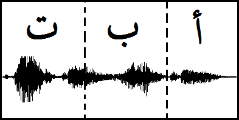

# Arabic Speech Corpus

This Speech corpus has been developed as part of PhD work carried out by [Nawar Halabi](https://uk.linkedin.com/pub/nawar-halabi/65/532/67b) at the [University of Southampton](http://www.southampton.ac.uk/). The corpus was recorded in south Levantine Arabic (Damascian accent) using a professional studio. Synthesized speech as an output using this corpus has produced a high quality, natural voice.

It is released here under the creative commons license specified below. In case further rights are required, or you require consultancy for building Arabic speech corpora, please contact Nawar Halabi by email. Thank you for your interest.

## The package includes
1813 .wav files containing spoken utterances.
1813 .lab files containing text utterances.
1813 .TextGrid files containing the phoneme labels with time stamps of the boundaries where these occur in the .wav files. These files can be opened using [Praat software](http://en.arabicspeechcorpus.com/www.fon.hum.uva.nl/praat/).
phonetic-transcript.txt which has the form "[wav_filename]" "[Phoneme Sequence]" in every line.
orthographic-transcript.txt which has the form "[wav_filename]" "[Orthographic Transcript]" in every line. Orthography is in [Buckwalter Format](http://www.qamus.org/transliteration.htm) which is friendlier where there is software that does not read Arabic script. It can be easily converted back to Arabic.
There is an extra 18 minutes of fully annotated corpus (separate from above but with the same structure as above) which was used to evaluted the corpus (see PhD thesis). Feel free to use it in your applications.

## Documentation
More documentation will be added in the future. Please refer to Nawar Halabi's [PhD Thesis](http://en.arabicspeechcorpus.com/Nawar%20Halabi%20PhD%20Thesis%20Revised.pdf) for more details. Please note that the apostrophe which follows some vowel phonemes in the corpus indicates that the vowel is in a stressed syllable. Feel free to visit the [Arabic Speech Corpus Wikipedia page](https://en.wikipedia.org/wiki/Arabic_Speech_Corpus) for more information about the corpus.

## License

Arabic Speech Corpus by Nawar Halabi is licensed under a [Creative Commons Attribution 4.0 International License](http://creativecommons.org/licenses/by/4.0/). Based on a work at www.arabicspeechcorpus.com.

---
              
Original Dataset: [Arabic-Speech-Corpus](http://en.arabicspeechcorpus.com)

DAGsHub Repository: [mert.bozkirr/Arabic-Speech-Corpus](https://dagshub.com/mert.bozkirr/Arabic-Speech-Corpus)

<!-- This comment is for making a new pull request -->

This open source contribution is part of [DagsHub x Hacktoberfest](https://dagshub.com/blog/hacktoberfest-x-dagshub-2/)              