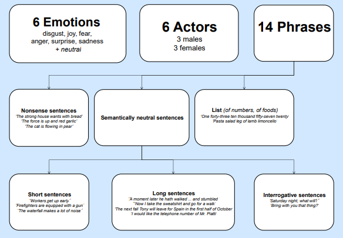
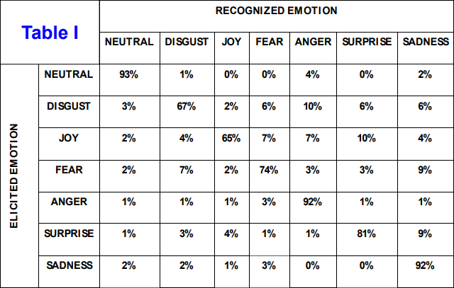

# EMOVO Corpus: an Italian Emotional Speech Database


It is a database built from the voices of up to 6 actors who played 14 sentences simulating 6 emotional states (disgust, fear, anger, joy, surprise, sadness) plus the neutral state. These emotions are well-known found in most of the literature related to emotional speech. The recordings were made with professional equipment in the Fondazione Ugo Bordoni laboratories. The paper also describes a subjective validation test of the corpus, based on emotion-discrimination of two sentences carried out by two different groups of 24 listeners. The test was successful because it yielded an overall recognition accuracy of 80%. It is observed that emotions less easy to recognize are joy and disgust, whereas the easiest to detect are anger, sadness, and the neutral state

**The similar version of dataset is uploaded to DagsHub: [EMOVO](https://dagshub.com/kingabzpro/EMOVO), enabling you to preview the dataset before downloading it.**

## Aim

A corpus of emotional voice is essential to build systems  of emotion recognition and systems of text-to-speech  synthesis with emotion rendering. The introduction of emotive voice in man-machine  communication finds its most important application in  building user interfaces for many services, in particular  call centers.

## Corpus Distribution



## Organization of the dataset

The dataset is small (335 MB) and simple to navigate as it has only six folders based on speaker ID. We also have a Document folder, which contains a research paper, a complete description of dataset labels, and a promotional poster for the dataset. There are 6 speakers, each speaker has to speak 14 sentences simulating 6 emotional states and each audio track is approximately 3 seconds long. The dataset labels are based on speaker identification, emotions, and sentence ID.

```
<root directory>
    |
    .- README.md
    |
    .- Documents/
    |
    .- Dataset/
          |
          .- f1/
          |
          .- f2/
          |
          .- f3/
          |
          .- m1/
          |
          .- m2/
          |
          .- m3/
          	  |
          	  .- dis-m3-b1.wav
          	  |
          	  .- dis-m3-b2.wav
          	  |
          	  ...
```

- **Audio Label Key**:

  - dis: disgust
  - gio: joy
  - pau: fear
  - rab: anger
  - sor: surprise
  - tri: sad
  - neu: neutral 

  [Emotion] -> [speakerID] -> [Sentence] = dis-m3-b1.wav

> For more information about Audio label read `LA STRUTTURA DI EMOVO.pdf` in Document folder. 

- **Documents**: 
  - LA STRUTTURA DI EMOVO.pdf: contains information about the types of emotions, biography of speakers, and sentence structure. It also contains the collection method. 
  - lrec14_paper3.pdf: Research paper on how the dataset is created, use case, and results.
  - poster emovo3.pdf: Promotional Poster to display key features of Datasets which includes Use case and Validation.

## Validation

The listeners were organized in two groups of 12 persons each, hosted  in two different labs. Subjects were asked to guess between 2 emotions. From each actor’s voice 2 nonsense sentences were proposed: this  prevented semantic content from biasing the guess among 7 outcomes. Each subject listened to the signals from a male and a female actor for a  total of 84 tests. The results of the two labs were statistically compatible. Hence, one  table only is presented in one table (see Table I)



## Use Case

- Lie detector (X13-VSA PRO): a system capable to assess whether a  user is lying. 
- E-learning.
- Automotive industry, in particular to enhance safety of the driver
- Video games
- Man-to-robot communication
- Investigation on human brain malfunctions
- Interaction with audio and visual entertainment systems

## Conclusion 

In the study of speech signal the emotional aspect plays an  increasing role because only through emotional  connotations become artificial voices more natural and  because the emotion recognition is an important parameter  in many applications. In order to characterize the  emotional voices it is essential to have a reference corpus.  Thus, the realization of EMOVO has made available to  the scientific community the first corpus of emotional  voice for Italian. 

## Acknowledgments

I would like to thank Giovanni Costantini, Iacopo Iadarola , Andrea Paoloni and Massimiliano Todisco for creating the dataset and making it available for public. 

## License 

The dataset is under open-source license and can be used for research purpose, for more information contact the author: GIOVANNI COSTANTINI -> costantini@uniroma2.it

---

**Original Dataset**: [EMOVO-ITA](http://voice.fub.it/activities/corpora/emovo/index.html)

**DAGsHub Dataset**: [kingabzpro/EMOVO](https://dagshub.com/kingabzpro/EMOVO)

**Photo** by <a href="https://unsplash.com/@tomramalho?utm_source=unsplash&utm_medium=referral&utm_content=creditCopyText">Tom Ramalho</a> on <a href="https://unsplash.com/s/photos/italian-emotions?utm_source=unsplash&utm_medium=referral&utm_content=creditCopyText">Unsplash</a>

---

*This open source contribution is part of [DagsHub x Hacktoberfest](https://dagshub.com/blog/hacktoberfest-x-dagshub-2/)*
