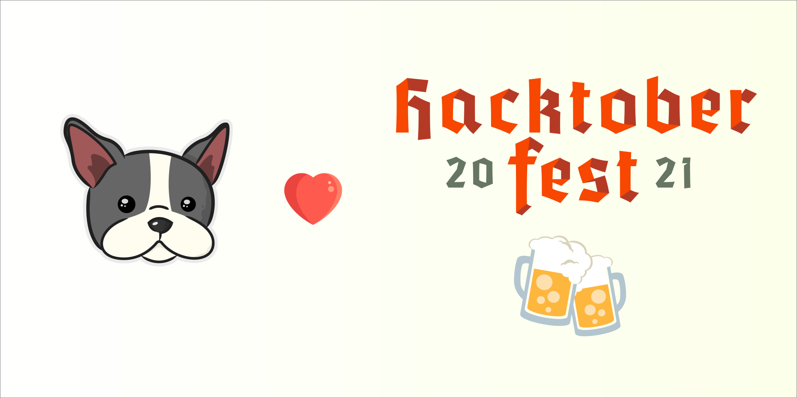
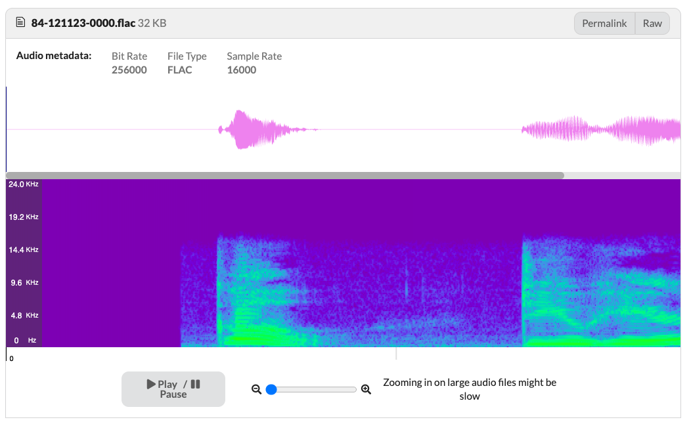

# Open-source Audio Datasets

[Hacktoberfest](https://hacktoberfest.digitalocean.com) is a month-long virtual festival of open source! Participants are giving back to the community by completing pull requests, participating in events, and donating to open-source projects. This project is part of Hacktoberfest 2021, where participants enrich the open-source audio datasets hosted on DagsHub.

## Quick Start to Contribution
- Sign-up to [Hacktoberfest](https://hacktoberfest.digitalocean.com/profile) & [DagsHub](https://dagshub.com/user/sign_up?redirect_to=).
- Join our [Hacktoberfest 2021 Discord channel](https://discord.gg/xAGgkNht).
- Read the [contribution guide lines](https://hacktoberfest.digitalocean.com/resources/participation).
- Create a Pull Requests on the GitHub [audio-datasets](https://github.com/DAGsHub/audio-datasets) repository.

## What does the DagsHub community contribute?
**This year we'd like to focus our contribution on the audio domain**. For that, we added audio data catalog capabilities to DagsHub! You can now upload audio files to DagsHub and see its spectrogram, wave, and even listen to it! You can see a vivid example of this (extremely cool) feature in our [Librispeech-ASR-corpus](https://dagshub.com/DagsHub/Librispeech-ASR-corpus/src/master/dev-clean/84/121123/84-121123-0000.flac) project.

To help audio practitioners leverage this new feature, we want to enrich open-source audio datasets on DagsHub. This is where you can contribute to the data science community! 

## How to contribute? 
- Claim the dataset you wish to contribute from the [list](https://github.com/jim-schwoebel/voice_datasets/blob/master/README.md) (KUDOS to 
[jim-schwoebel](https://github.com/jim-schwoebel)) by opening a new issue on the [GitHub repository](https://github.com/DAGsHub/audio-datasets) and name it after the dataset. Please make sure that the dataset wasn't claimed. 
- Open a new DagsHub repository and upload the data to its DVC storage (e.g., [dataset repository](https://dagshub.com/DagsHub/Librispeech-ASR-corpus)).
- Write information about the dataset in the README file (e.g., [Librispeech ASR corpus README](https://dagshub.com/DagsHub/Librispeech-ASR-corpus/src/master/README.md)). 
- Add relevant tags to the repository and files.
- Add the following labels to the repository:
  - `dataset` 
  - `audio`
  - `hacktoberfest`
- In the GitHub [audio-datasets](https://github.com/DAGsHub/audio-datasets) project:
  - Open a new branch named after the dataset.
  - Add a directory named after the dataset with the README file.
  - Commit and push the changes to GitHub.
  - Create a pull request on GitHub.
- Optional: Share the project on DagsHub [Hacktoberfest 2021 Discord channel](https://discord.gg/xAGgkNht).

## Hacktoberfest FAQ
## Does DagsHub provide any special swag? 

DagsHub will send swag to all participants who create at least 2 pull requests during Hacktoberfest. If you make more than 10 pull requests, we'll send special swag your way!

Sunny our Chief Dog Scientist getting some of our new swag!

## How can I contact the DagsHub team for support?

The DagsHub team (& community) is available 24/7 in the DagsHub Discord channel. We ask that questions regarding the Hacktoberfest will be asked in the [Hacktoberfest Discord channel.](https://discord.com/invite/xAGgkNht)

Do I need to sign-up for Hacktoberfest to contribute to DagsHub audio datasets?
You don't need to be a registered Hacktoberfest user to contribute to this project. However, we highly recommend doing it to get a chance to win the challenge and get to know other cool open-source projects.

## I signed up for Hacktoberfest in mid-October. Will pull requests that I created earlier in October count?

Yes, all pull requests created between October 1st and October 31st will count, regardless of when you register for Hacktoberfest. Pull requests created before October 1st but merged or marked as ready for review after do not count. Pull requests that are still in review after October 31st and meet the criteria will count towards your completion goal.

